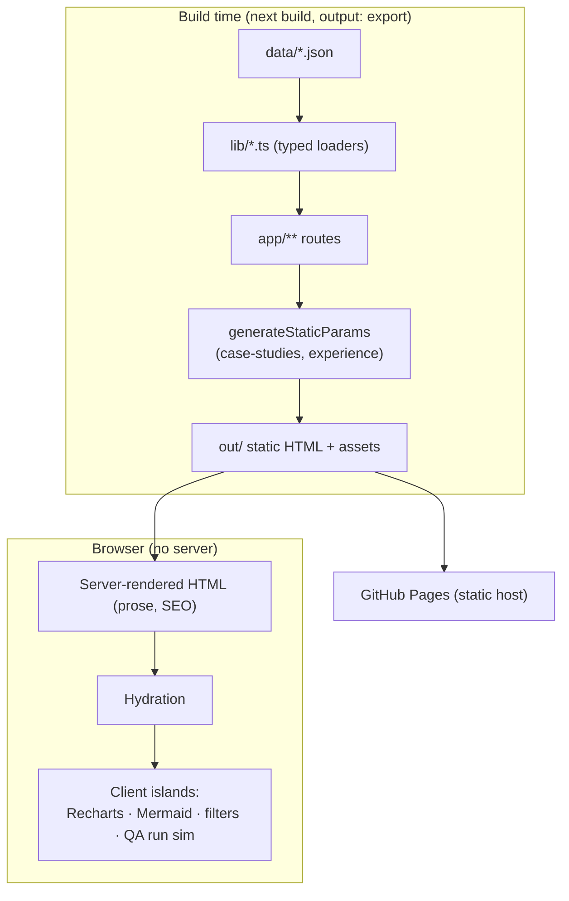
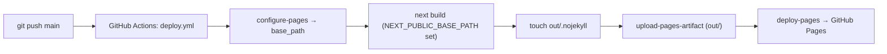

# ARCHITECTURE

> Continuity doc 2 of 16.

## System architecture



No server runtime. Everything is static HTML/JS/CSS served by GitHub Pages.

## Folder structure
```
app/
  layout.tsx            Root layout (metadata, viewport, fonts)
  page.tsx              Landing / About
  globals.css           Tailwind layers + theme tokens
  control-tower/
    layout.tsx          Sidebar + MobileNav shell
    page.tsx            Executive dashboard
    observability/page.tsx
    qa/page.tsx         QA Governance (tabs: Test Suites | Governance)
    devops/page.tsx     DevOps / DORA
    program/page.tsx    Program Health
  experience/
    page.tsx            Timeline + tag filter (ExperienceExplorer)
    [slug]/page.tsx     Per-company detail (generateStaticParams)
    education/page.tsx   Education, Certifications, Recognitions
  case-studies/
    page.tsx            Index
    [slug]/page.tsx     Detail (generateStaticParams)
  system-design/page.tsx  5 Mermaid architectures
components/
  layout/   Sidebar, Topbar, MobileNav, SiteHeader
  ui/       KpiCard, Panel, StatusBadge
  charts/   ChartKit (themed Recharts tooltip + axis props)
  experience/ Timeline, ExperienceExplorer
  qa/       TestSuitesView (QA POC, interactive)
  Mermaid.tsx  Client diagram renderer
lib/        format.ts, case-studies.ts, experience.ts, system-design.ts
data/       executive/agent/qa/devops/program_metrics.json, qa_suites.json, resume.json, profile.json
public/     certificates/*.pdf
```

## Modules / route map
| Route | Type | Source data |
|---|---|---|
| `/` | static | inline + cross-links |
| `/control-tower` (Executive) | static, client | `executive_metrics.json` |
| `/control-tower/observability` | static, client | `agent_metrics.json` |
| `/control-tower/qa` | static, client | `qa_metrics.json`, `qa_suites.json` |
| `/control-tower/devops` | static, client | `devops_metrics.json` |
| `/control-tower/program` | static, client | `program_metrics.json` |
| `/experience` | static, client filter | `resume.json` |
| `/experience/[slug]` | SSG (6) | `resume.json` |
| `/experience/education` | static | `profile.json` + fs check on `public/certificates/` |
| `/case-studies` + `/case-studies/[slug]` | SSG (3) | `lib/case-studies.ts` |
| `/system-design` | static, client (Mermaid) | `lib/system-design.ts` |

## Components / services
- **Presentational/server:** Panel, KpiCard, StatusBadge, Timeline, Topbar.
- **Client islands (`'use client'`):** ChartKit-based charts on every dashboard, Mermaid, ExperienceExplorer (tag filter), SiteHeader/Sidebar/MobileNav (active-link via `usePathname`), TestSuitesView (suite selector + simulated run via `useState`/`setTimeout`).
- **Helpers (`lib/format.ts`):** number/currency/percent/date formatters, `statusTone()` + `toneClasses` (semantic status colors), `palette` (chart colors).

## APIs / integrations
None at runtime. No backend, no external API calls. The only "integration" is the GitHub Actions → Pages deploy. Certificate links point to repo-hosted PDFs under `public/certificates/` (or optional external URLs).

## Data models (TypeScript, in `lib/`)
- `lib/experience.ts` — `Company` (slug, company, role, period, start, industry, theme, summary, business_context[], key_challenges[], initiatives[], responsibilities[], technical_environment{cloud,data,ai,tools}, delivery_practices[], metrics[{value,impact}], achievements[], portfolio_tags[], process_flow) + `companies`, `allTags`, `flattenTech()`.
- `lib/case-studies.ts` — `CaseStudy` (slug, title, role, timeline, stack[], summary, heroMetrics[], sections[{heading, paragraphs?, bullets?, metrics?, mermaid?, table?}]).
- `lib/system-design.ts` — `Diagram` (id, title, summary, chart (Mermaid), components[]).
- `data/profile.json` — education[], certifications[{category, credentials[{title,issuer,period,status,file}]}], recognitions[].
- `data/*_metrics.json` + `qa_suites.json` — dashboard mock datasets (shapes consumed directly by their pages).

## Database structure
None. All "data" is static JSON in `data/` and TS constants in `lib/`. No DB, no ORM.

## State management
Local React state only (`useState`/`useMemo`/`useEffect`) inside client islands (tag filter, QA suite selection + run simulation, QA tab toggle). No global store, no context, no server state.

## Authentication flows
None. Fully public, read-only site. (The owner's separate QA POC at `qa.staging.zbrain.ai` is login-walled, but that is a different app, not part of this repo.)

## Deployment architecture


## External dependencies
`next@14.2.5`, `react@18.3.1`, `react-dom@18.3.1`, `recharts@2.12.7`, `mermaid@^11.15.0`; dev: `typescript@5`, `tailwindcss@3.4`, `postcss`, `autoprefixer`, `eslint`, `eslint-config-next`, `@types/*`. No other runtime services.
